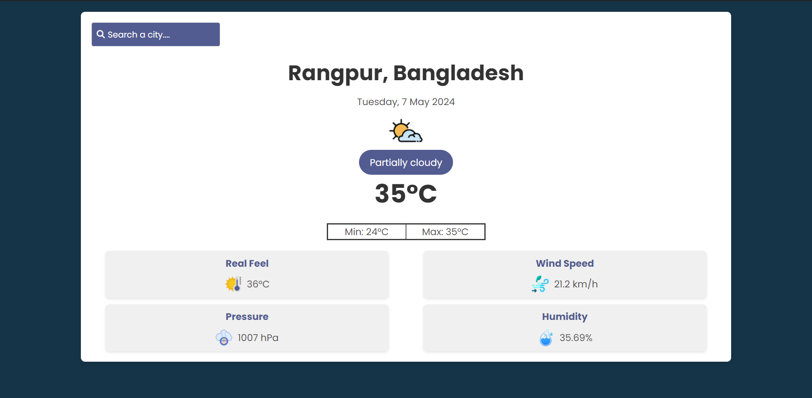

# Weather App



## Description

The Weather App provides current weather information and forecasts for a given city. It offers a clean and intuitive interface that includes temperature, weather conditions, wind speed, humidity, and more. Users can search for any city to get the latest weather updates.

## Features

- Search for a city to get its weather information
- Displays the city name, date and time, and weather conditions
- Shows current temperature, real feel, minimum and maximum temperatures
- Displays wind speed, air pressure, and humidity
- Uses an external weather API for data (Visual Crossing Weather API)
- Uses Font Awesome icons and Google Fonts for design elements

## Technologies Used

- HTML5
- CSS3
- JavaScript (ES6+)
- Visual Crossing Weather API
- OpenCage Data API
- Font Awesome icons
- Google Fonts
- Freepik

## Installation

1. Clone this repository:

   ```shell
   git clone https://github.com/junayedhasansakib0/weather-app.git
   ```

2. Navigate to the project directory:

   ```shell
   cd weather-app
   ```

3. Open the `index.html` file in your web browser.

## Usage

- Enter a city name in the search bar and hit Enter.
- The app will fetch the weather information for the entered city and display it on the page.

## API Key

The app uses the Visual Crossing Weather API. Replace the `API_KEY` variable in `script.js` with your own API key.

## Customization

- Customize the app by modifying the CSS styles in `assets/css/style.css`.
- The API URL and request options are defined in `script.js`.

## Contributing

Contributions are welcome! If you find any issues or have suggestions for improvements, please open an issue or pull request.

## License

This project is licensed under the [MIT License](LICENSE). Please read the [LICENSE](LICENSE) file for more information.

## Credits

- [Visual Crossing Weather API](https://www.visualcrossing.com/weather-api) for weather data.
- [OpenCage Data API](https://opencagedata.com/) for GEO Coding Data.
- [Font Awesome](https://fontawesome.com/) for icons.
- [Google Fonts](https://fonts.google.com/) for web fonts.
- [Flaticon](https://www.flaticon.com/) for some png's icon.

## Contact

For any inquiries or feedback, please contact [Junyaed Hasan Sakib](mailto:junayedhasan0271@gmail.com).
